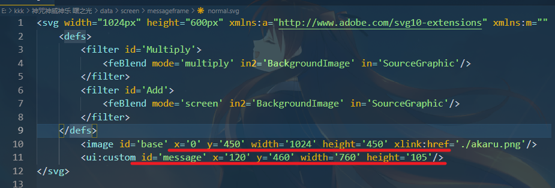
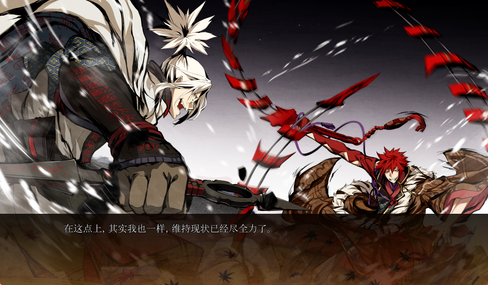

## KKK_r18_patch


### 关于神咒神威神乐 （kkk） 

light社在2011年发布了R18的游戏初版，13年给游戏新增了剧情，对老版的剧情安排和剧本再次修改后发布了全年龄版的神咒神威神楽 ·曙之光。

此补丁主要目的是帮玩家补完老版内容，同时实现横版文字。受剧本限制，暂时不可能做出一个同时兼具老版和曙光版所有内容的补丁。所以采取了dies irae的DX英版的方案，让曙光补丁和老版r18共存并共享资源文件。

- 使用方法（待发布）

---

## 目前进度

- 用户界面均已修完，设定图估计有万字以上，翻译需要时间
- 咲耶的信，老翻译有必要重新校对，修图1/4
- r18版多余文本0/2649

尽量赶在di官汉发布后一起发布，毕竟kkk是di的fd


## 移植&汉化过程

### 补丁制作

- 先说一下补丁运行的逻辑

malie引擎会从上到下读取dat封包文件，使用malie_packer将修改后的脚本文件封为data7.dat，可以直接覆盖旧文本，剧本是unicode编码（正田要用神代文导致的），所以也不存在日语编码。具体方法见di的仓库 [dies_aitrans](https://github.com/Akaruzi/dies_aitrans)

R18版跟曙光版的封包加密是不一样的，如何读取加密封包都写进了各自的exe执行程序。按道理来说是实现不了dx版的全年龄版和r18版复用资源的效果。但我测试发现曙光版的exe可以读取老版的剧本正常运行，虽然不清楚原理。做补丁的思路就可以跟di一样了，创建新的dat封包再和malie.ini一起跟exe打包即可。

- **未解决的问题**

kkk的exe有一层硬壳，我试过engimavb和molebox都不能正常打包，没有脱壳的技术力，目前也没能找到其他解决方法。有知道方法的朋友还请联系我。

### R18脚本移植

曙光版除了新增剧情以外，对老版的文本有大量的删改。不能简单地提取日语文本对比移植，必须挨个检查对照。这里我把老版的文本对着曙光版都给调好了，曙光版删掉的文本一律换成了空白，想把kkk翻译成其他语言的朋友可以参考这个json字典进行移植。

r18版被删减或者不能复用的文本有2649行，hs的文本粗略估计在1000行左右。

### 修图


#### 图片如何调用

好像light社的汉化都没有修过图，原因大概率是malie处理图片的机制太过麻烦。游戏中世纪出现的cg都是由图片集中多张小图拼接起来的。参与图片资源调用的文件有三种`.svg`, `.dzi`, `tex`目录下的图片集，我先分别做个介绍。

- svg文件规定了调用哪张图片，图片大小和位置。
```<image id='image' x='0' y='0' width='2048' height='1200' xlink:href='./001_a.dzi'/>```
width 和 height 规定了图片的长宽，不用保持原分辨率比例，更改后游戏内会基于你给的width, height对图片做一个相应的缩放
`href='...'`指向的是调用的图片，这里填的是dzi，也可以是png，实际调用的都是tex/001_a这一个图片集。
- dzi文件规定了图片集如何拼接，以001_a.dzi为例：


第三行 3 表示001_a这组图片集有三种拼接方式分别是：一行8张，共5行；一行4张，共3行；一行2张，共2行

调用哪一种取决于游戏分辨率，全屏采用第一种，窗口模式采用第二种。

- tex目录下的图片集

一般每个图片集都有0,1,2三个文件夹，里面存放了为不同分辨率下的游戏调用正dzi里所写的内容。


#### 如何修图

- 普通图片
  更改svg文件中的`image` tag中的链接指向即可，在没有对应dzi的情况下图片不会拼接，例如：
  将href='./001_a.dzi'改为'href=./001_a_cn.png'，并在event目录下放好改过的图001_a_cn.png，游戏便可正常调用。

  需要修的图都在在screen目录下


- 咲耶的信
  中文可以竖排阅读，所以在原图上进行修改即可。


​	其他语言需要调节对应的x，y，调节width和height的大小以和修过的图匹配，例如：


- **文字横版以及文本框的修改**

解包的exec.str.txt文件，修改`msgfrrame type` 如下


然后在`data/screen/messagebox`中更改`normal.svg` 文件 ，选取比较合适的长宽和文本位置，文本框背景不能直接换成png图片，所以调了一个dzi来改变背景







- 快速测试

当涉及到修改svg文件的宽高时需要反复看实际效果调试，频繁封包会非常麻烦。所以建议先用garbro解包图片文件，并删掉对应datax.dat文件实现免封包。保持游戏运行，修改相应文件后，切换窗口全屏模式可以让游戏重新载入配置文件，以查看修图效果。


