## KKK_r18_patch


### 关于神咒神威神乐 （kkk & 3k & kajiri kamui kagura） 

light社在2011年发布了R18的游戏无印版，13年给游戏新增了剧情，并对剧情安排和剧本再次修改后发布了全年龄版的《神咒神威神楽 ·曙之光》。

主要区别在于：曙光删掉了所有hs，额外添加了五章的内容，并在开头提供了神代文语音解锁的功能。参见[正田访谈](https://dengekionline.com/elem/000/000/597/597522/index-2.html)

此补丁主要目的是帮玩家补完无印版内容，同时实现横版文字。受剧本限制，暂时不可能做出一个同时兼具老版和曙光版所有内容的补丁。所以采取了dies irae的DX英版的方案，让曙光补丁和无印版（r18）共存并共享资源文件。

## 目前进度

- 用户界面均已修完，设定图字数36000+ 初翻几乎完成，待二校
- 设定图，菜单栏，界面设定图，对话框，标题界面图，状态图，全部修完（包括无印版）
- 咲耶的信初翻完成，字数6000+，待校对
- 无印版hs 4/8

~~尽量赶在di官汉发布后一起发布，毕竟kkk是di的fd~~
不知道等到何年何月，还是找个好日子发了

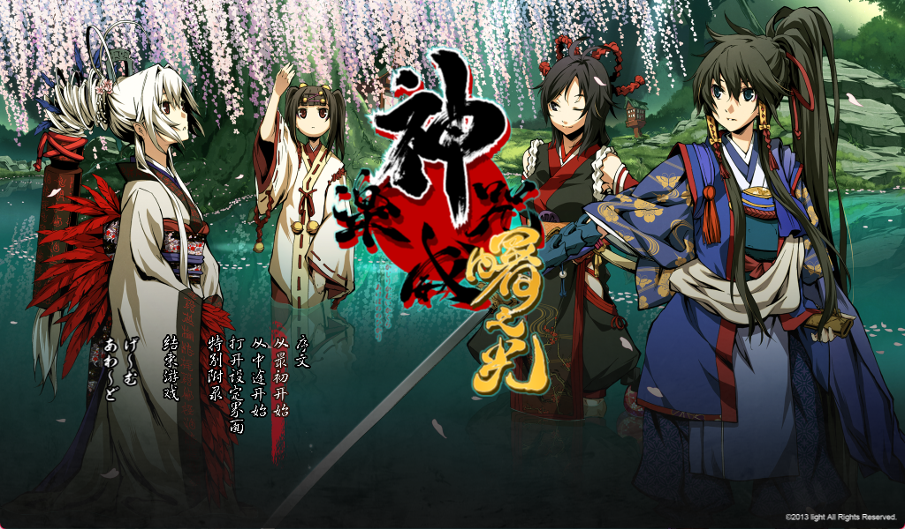

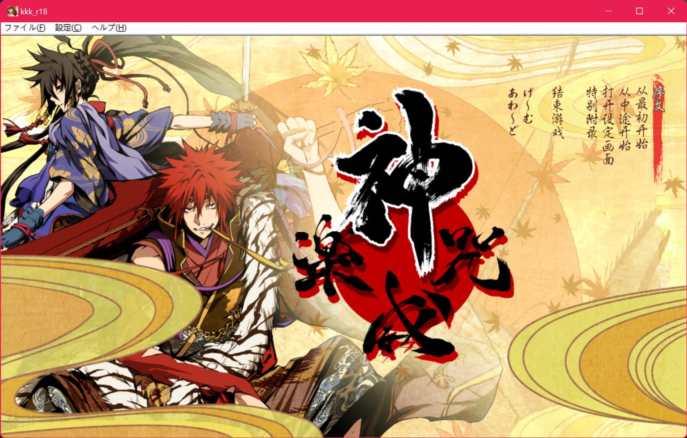

## 移植&汉化过程

### 补丁制作

- 先说一下补丁运行的逻辑

malie引擎会从上到下读取dat封包文件，使用malie_packer将修改后的脚本文件封为data7.dat，可以直接覆盖旧文本，剧本是unicode编码（正田要用神代文导致的），所以也不存在日语编码。具体方法见di的仓库 [dies_aitrans](https://github.com/Akaruzi/dies_aitrans)

无印版（R18）跟曙光版的封包加密是不一样的，如何读取加密封包都写进了各自的exe执行程序。所以需要解包无印版cg以曙光版的加密进行dat封包。再用enigmavb分别将对应的malie.ini和不能复用的修图等文件跟exe一切打包即可实现类似di_dx版的双补丁。

- exe的alpharom脱壳

kkk的exe有一层硬壳，未脱壳前我试过enigmavb和molebox都不能正常打包。感谢[Cosetto](https://github.com/Cosetto)做的脱壳 [malie.zip](https://github.com/Akaruzi/dies_aitrans/files/15195709/malie.zip)，现在可以用enigmavb正常打包，reshacker修改提示字段。

- 用reshacker修改Menu/APP3:1041和String Table/1:1041里的字段来翻译提示框。

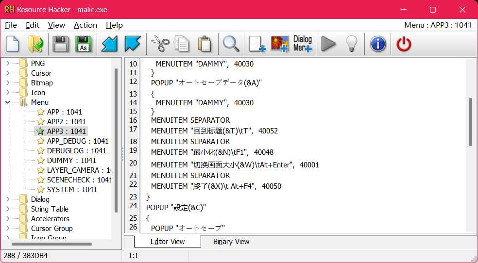

### R18脚本移植

曙光版除了新增剧情以外，对老版的文本有大量的删改。不能简单地提取日语文本对比移植，必须挨个检查对照。这里我把老版的文本对着曙光版都给调好了，曙光版删掉的文本一律换成了空白，想把kkk翻译成其他语言的朋友可以参考[r18_aa_dic.json](./r18_aa_dic.json)进行移植。

r18版被删减或者不能复用的文本有2649行，hs的文本粗略估计在1000行左右。

#### 神代文字

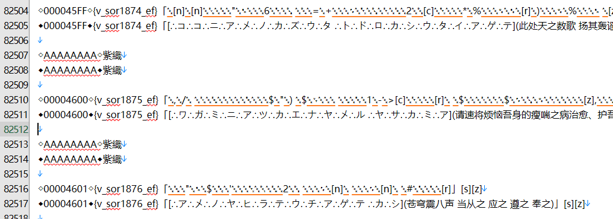

剧本中使用了很多神代文字，提取出来的文本是无法以utf-8编码表示的unicode，与假名对应关系参见moji_dic.md，可以使用[jd_trans.py](./jd_tran.py)转换

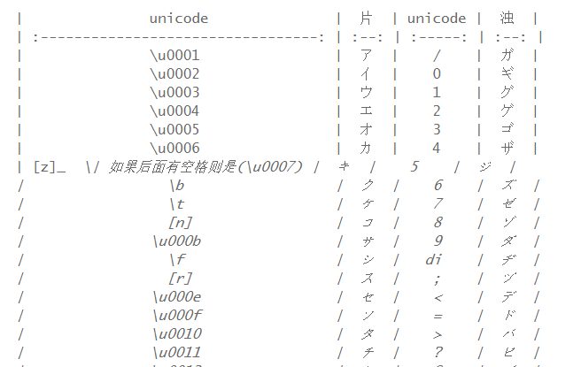


### 修图

#### 需要修的图片

- /data/screen/conifg/ 中的界面设定图 36
- /data/screen/menu/ 菜单栏 20
- /data/screen/messagebox/ 对话框 9
- /data/screen/title/ 标题界面图 24
- /data/screen/event 中咲耶的信 120+; 字数6000+
- /data/screen/status/ 设定图 111; 字数36000+

所有图片均用garbro提取为png格式

文本量较大的是咲耶的信和设定图，前者的文本来自[chinnyachebe](https://www.youtube.com/watch?v=ad7GkauL-6I),见仓库[tegami](./tegami/); 后者文本均用ocr的方式提取，见仓库[status](./status/merged_jp.txt)


#### 图片如何调用

好像light社的汉化都没有修过图，原因大概率是malie处理图片的机制太过麻烦。游戏中出现的cg都是由图片集中多张小图拼接起来的。参与图片资源调用的文件有三种`.svg`, `.dzi`, `tex`目录下的图片集，我先分别做个介绍。

- svg文件规定了调用哪张图片，图片大小和位置。
```<image id='image' x='0' y='0' width='2048' height='1200' xlink:href='./001_a.dzi'/>```
width 和 height 规定了图片的长宽，不用保持原分辨率比例，更改后游戏内会基于你给的width, height对图片做一个相应的缩放
`href='...'`指向的是调用的图片，这里填的是dzi，也可以是png，实际调用的都是tex/001_a这一个图片集。
- dzi文件规定了图片集如何拼接，以001_a.dzi为例：

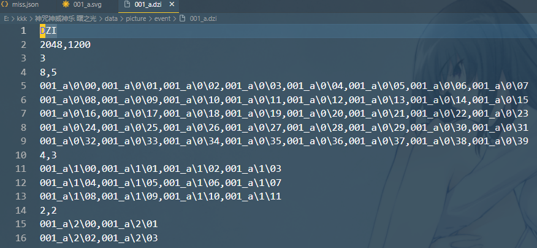

第三行 3 表示001_a这组图片集有三种拼接方式分别是：一行8张，共5行；一行4张，共3行；一行2张，共2行

调用哪一种取决于游戏分辨率，全屏采用第一种，窗口模式采用第二种。

- tex目录下的图片集

一般每个图片集都有0,1,2三个文件夹，里面存放了为不同分辨率下的游戏调用正dzi里所写的内容。


#### 如何修图

- 普通图片
  更改svg文件中的`image` tag中的链接指向即可，在没有对应dzi的情况下图片不会拼接，例如：
  将href='./001_a.dzi'改为'href=./001_a_cn.png'，并在event目录下放好改过的图001_a_cn.png，游戏便可正常调用。

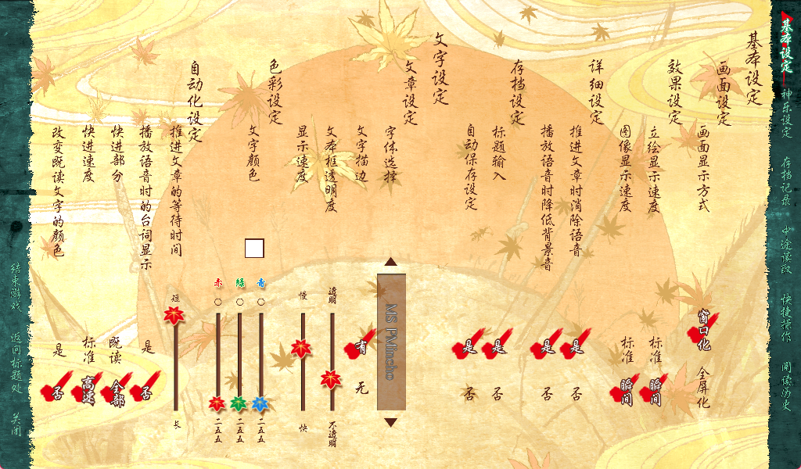

- 咲耶的信
  中文可以竖排阅读，所以在原图上进行修改即可。
  序章内嵌修图见 [【神咒神威神乐】序章・凶月咲耶的信 内嵌修图版预览](https://www.bilibili.com/video/BV1SJ4m1p7wF/?share_source=copy_web&vd_source=be1d4cd76c7c7c916a31c6de27adff8b)

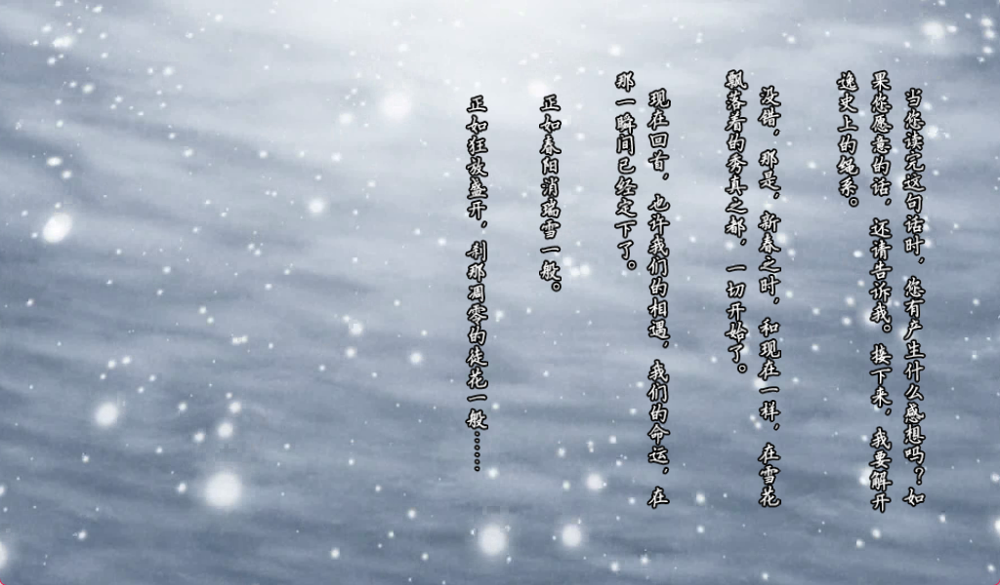


其他语言需要调节对应的x，y，调节width和height的大小以和修过的图匹配，例如：

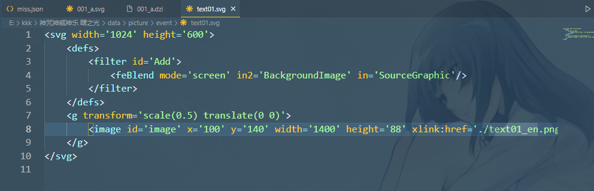

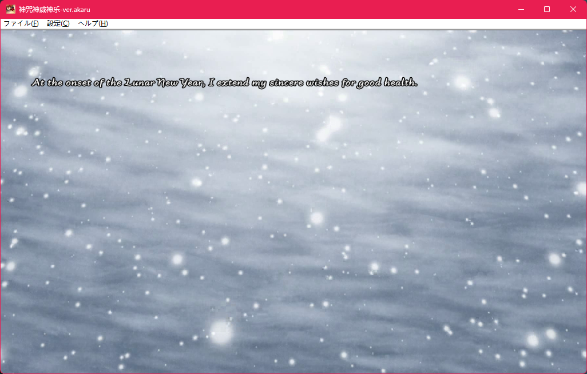


- **文字横版以及文本框的修改**

解包的exec.str.txt文件，修改`msgframe type` 如下

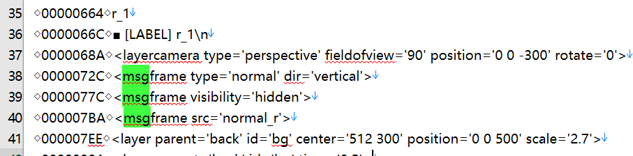

然后在`data/screen/messageframe`中更改`normal.svg`。这里建议直接用我改好的[normal.svg](./example/screen/messageframe/normal.svg) ，可以适当调整x,y来改变文本以及文本框的位置。
带人物表情的文本框用同样的方法修改`face_c.svg`, `face_l.svg`, `face_r.svg`，可以用我改好的。

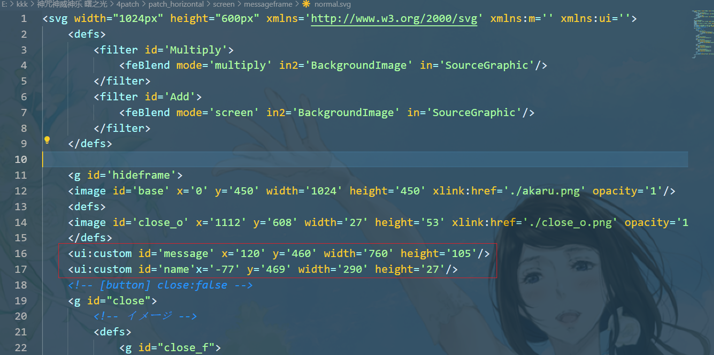

效果图：

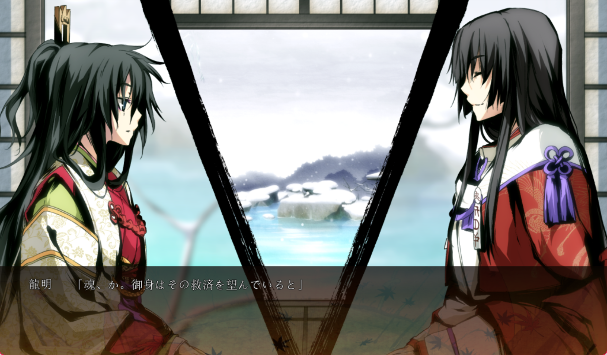


- 快速测试

当涉及到修改svg文件的宽高时需要反复看实际效果调试，频繁封包会非常麻烦。所以建议先用garbro解包图片文件，并删掉对应datax.dat文件实现免封包。保持游戏运行，修改相应文件后，切换窗口全屏模式可以让游戏重新载入配置文件，以查看修图效果。


