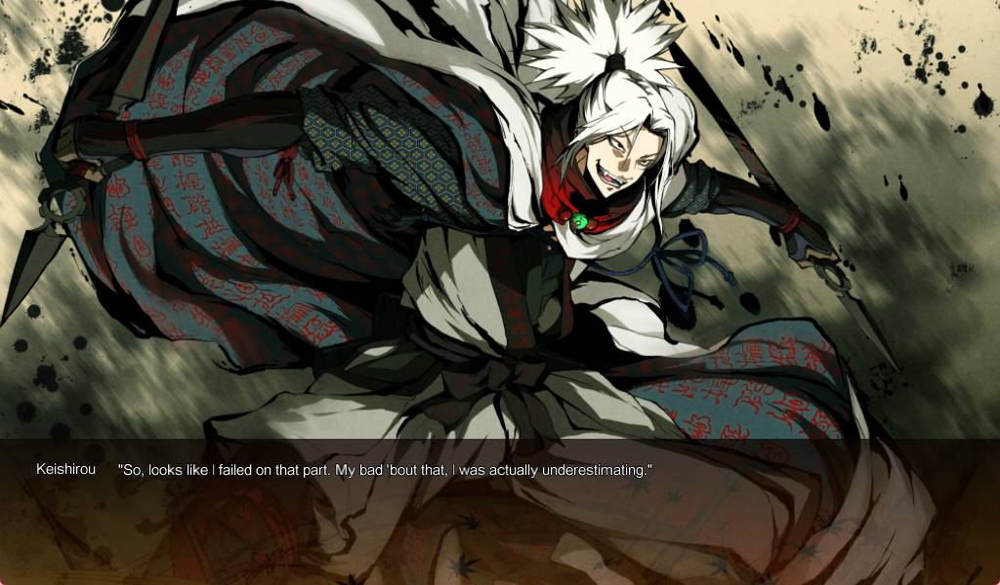
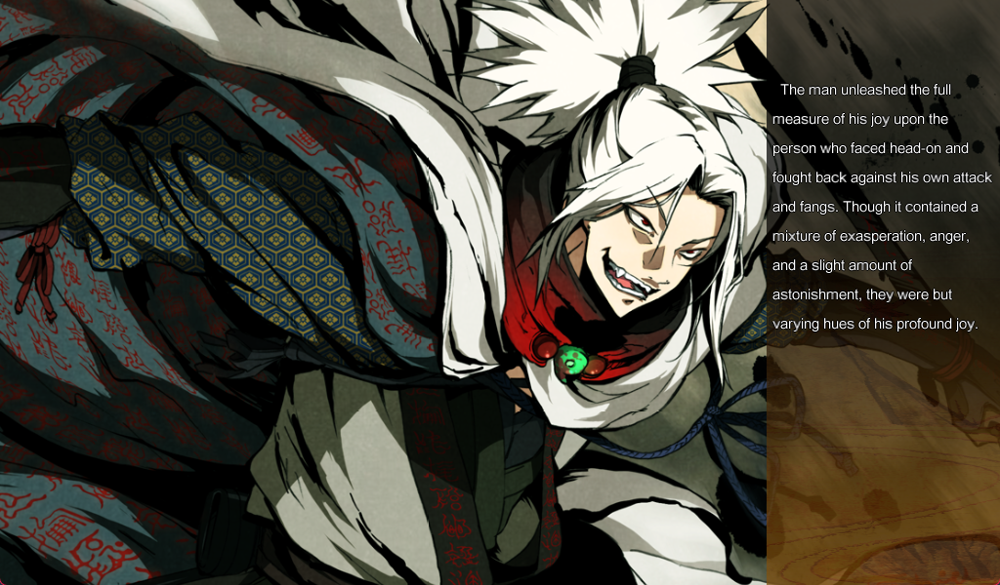
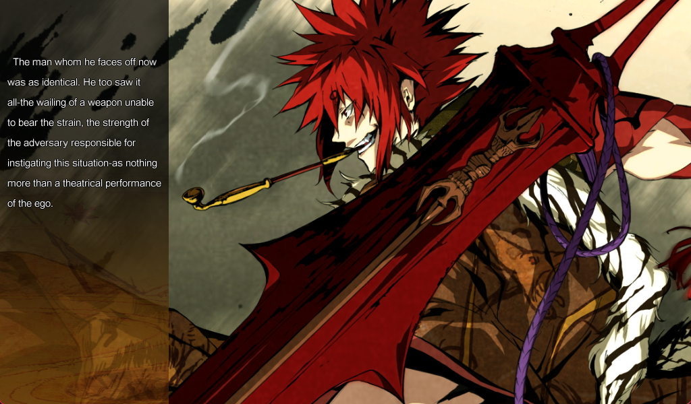
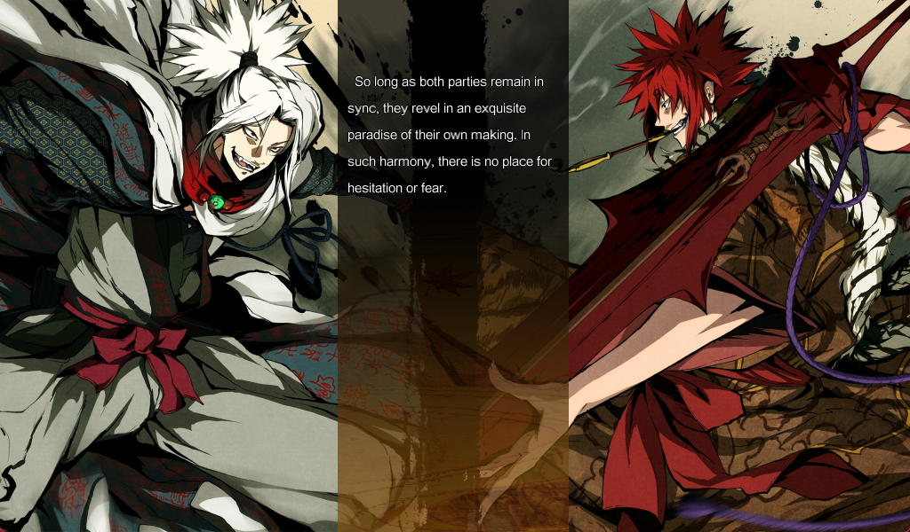
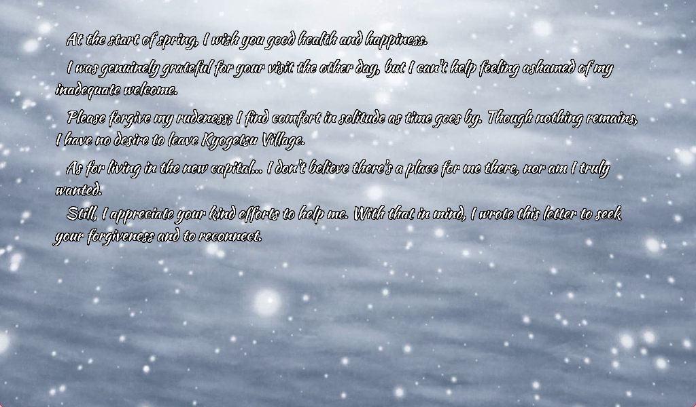

# K3 DIY Translation Tutorial

The long-standing lack of translation for K3 is likely due to Masada's ornate writing style, as well as technical obstacles, particularly the vertical orientation of all text. This tutorial aims to address the latter issue for all willing and enthusiastic fan translators. And please don't use it for mtl.

This tutorial assumes you already know how to use Malie_ScriptTool to compile game script files and Malie's packer for packaging, so I won't go into extensive detail and will only cover the key points.

## WordWrap

Before discussing the horizontal text patch, I must first mention the wordwrap issue. Except for the Steam version of Dies Irae, Malie lacks automatic wordwrap functionality for English scripts. This necessitates manually adding `[n]` to the script to achieve line breaks.

I've prepared a [automatic script](./entrans/wordwrap/ww.py) for this purpose, originally based on work by Costteo and Deca, which I've refined for more practical adjustments. I've considered font width of the Latin alphabet for line breaks to improve readability, which is particularly crucial for the second type of horizontal patch that requires multiple line breaks for each text segment.

## Horizontal Text Patch

There are two options for the horizontal text patch, as shown in the images below.

- The first type is completely horizontal, with a text box similar to ADV, while also adding a name line.

- The second type retains the vertical text box but allows for horizontal reading, which is the most faithful way to restore the unique style of K3.

 

## Sakuya's Letters

Sakuya's Letters actually exist as images, implemented using .svg and .png files. The former defines the file's position, while the latter is the called image. For Chinese, since it can be read vertically, the former doesn't need adjustment; only the .png files need modification. However, for language like English that cannot be read vertically, it'll be very troublesome as each file must be rewritten or recreated.

To address this, I've prepared an [automated script](./entrans/tgm/epic.py). You only need to provide the translated text, and it will directly convert it into these two file types.

# Credit

Tutorial provider:

- Akaruzi (魔法野马)

Translation of the demonstration images:

- [Confirm](https://kakuninblog.wordpress.com/)

Tool providers:

- [Crsky](https://github.com/crskycode/Malie_Script_Tool) (Malie ScriptTool)

- [satan53x](https://github.com/satan53x/SExtractor) (Malie's packer)

Special thanks to:

- [Cosetto](https://github.com/Cosetto)

- [Monaco A. Knox](https://github.com/Monaco-a-Knox)

